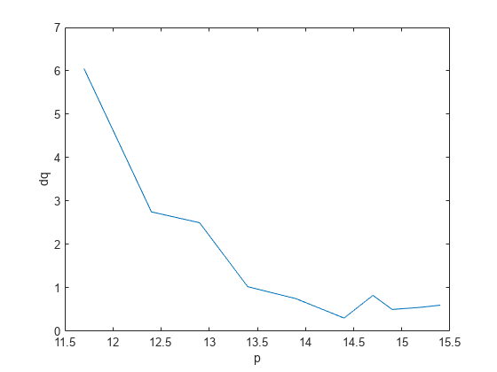

```matlab:Code
% cleaning environment
clc
clear all
```

```matlab:Code
% importing data
df1 = readtable("https://docs.google.com/spreadsheets/d/e/2PACX-1vQgTBH8O8poeZfj9jzisyRf7N_LQ4I4pW6F1-crvknL2diNhYowfQI-BnnuvBbyuJh1FurJZ_X3Q5_5/pub?gid=999031192&single=true&output=csv")
df2 = readtable("https://docs.google.com/spreadsheets/d/e/2PACX-1vQgTBH8O8poeZfj9jzisyRf7N_LQ4I4pW6F1-crvknL2diNhYowfQI-BnnuvBbyuJh1FurJZ_X3Q5_5/pub?gid=0&single=true&output=csv")
df3 = readtable("https://docs.google.com/spreadsheets/d/e/2PACX-1vQgTBH8O8poeZfj9jzisyRf7N_LQ4I4pW6F1-crvknL2diNhYowfQI-BnnuvBbyuJh1FurJZ_X3Q5_5/pub?gid=905714583&single=true&output=csv")
df4 = readtable("https://docs.google.com/spreadsheets/d/e/2PACX-1vQgTBH8O8poeZfj9jzisyRf7N_LQ4I4pW6F1-crvknL2diNhYowfQI-BnnuvBbyuJh1FurJZ_X3Q5_5/pub?gid=245849005&single=true&output=csv")
```

```matlab:Code
% assegno lunghezza oggetto
o = df1.value
% calcolo p: distanza oggetto-lente
p = abs(df2.x_lente-df2.x_oggetto);
dp = df2.x_uncertainty*2;
df2.p = p;
df2.dp = dp;

% calcolo q: distanza lente-immagine
q_inf = abs(df2.x_lente - df2.x_schermo_inf);
q_sup = abs(df2.x_lente - df2.x_schermo_sup);
q = (q_inf+q_sup)/2;
% l'incertezza sulla posizione dello schermo è data dal semi-intervallo entro il quale l'immagine appare ugualmente nitida
dq = abs(df2.x_schermo_sup - df2.x_schermo_inf)/2;
df2.q = q;
df2.dq = dq;

plot(p,dq)
xlabel("p")
ylabel("dq")
```

noto che l'ampiezza del semi intervallo diminuisce all'aumentare di p distanza oggetto lente

```matlab:Code
% esporto tabella per relazione (converto in testo e approssimo)
[tp, tdp] = signum2str(p,dp);
[tq, tdq] = signum2str(q,dq);
pq = array2table([tp, tdp, tq, tdq],"VariableNames",{'p','\delta p','q','\delta q'})
writetable(pq,"../data/pq.csv")
```

# Determinazione diretta della distanza focale

```matlab:Code
% calcolo f mediante formula (2) scheda
f = (p.*q)./(p+q);

% propagazione errore su f
df = sqrt((((q./(p+q)).^2).*dp).^2 + (((p./(p+q)).^2).*dq).^2);

% esporto tabella con f e incertezze
[tf, tdf] = signum2str(f,df);
table = array2table([tf tdf],"VariableNames",{'f','$\delta f$'})
```

| |f|$\\delta f$|
|:--:|:--:|:--:|
|1|"9.5"|"0.2"|
|2|"9.5"|"0.2"|
|3|"9.7"|"0.2"|
|4|"9.64"|"0.1"|
|5|"9.70"|"0.08"|
|6|"9.68"|"0.06"|
|7|"9.7"|"0.1"|
|8|"9.76"|"0.07"|
|9|"9.74"|"0.08"|
|10|"9.77"|"0.09"|

```matlab:Code
writetable(table,"../data/fdirect.csv")

% media di f
fm = mean(f);
dfm = mean(df);
[fm, dfm] = siground(fm,dfm)
[tfm, tdfm] = signum2str(fm,dfm)
```

```text:Output
tfm = '9.7'
tdfm = '0.1'
```

```matlab:Code
% rappresento f con le incertezze
fig=figure;
errorbar(p,f,df,df,dp,dp,'o')
hold on
plot([10:16],repelem(fm,length([10:16])),'Color','#D95319')
hold off
ylim([9 10])
xlim([11 16])
xlabel("p [cm]")
ylabel("f [cm]")
legend("Misure di f","Media",'Location','southeast')
saveas(fig,"../img/pf.png")
```



# Significatività della correlazione lineare: indice di Bravais-Pearson

linearizzo l'equazione 

verificare la propagazione degli errori del reciproco. Mi sembra strano si riduca così.

```matlab:Code
% linearizzo equazione
y  = 1./q;
dy = usiground(dq./q.^2); % equivalente a (dq./q).*y
x  = 1./p;
dx = usiground(dp./p.^2);

% converto in testo per esportare tabella con corretto numero di cifre
% significative
[tx, tdx] = signum2str(x,dx);
[ty, tdy] = signum2str(y,dy);
linearize_text_data = array2table([tx tdx ty tdy],"VariableNames",["x","dx","y","dy"])
% esporto in csv
writetable(linearize_text_data,"../data/linearized.csv")

% plot
figure;
errorbar(x,y,dy,dy,dx,dx,'o')
xlabel("x = 1/p [cm]")
ylabel("y=1/p [cm]")
grid on
```

```matlab:Code
% coefficiente di bravais pearson

% funzione personale
r1 = abs(bravpear(x,y))
% funzione matlab
[r2, pval] = corr(x,y)
pval < 0.01
```

in questo modo ho comunque verificato che la funzione corr() torna esattamente il valore voluto ovvero quello della funzione bravpear() che corrisponde alla formula per calcolare bravais pearson.

A seguito del calcolo del coefficiente di Bravais-Pearson e del p-value (probabilità che un'insieme di dati presenti una forma di quel tipo senza rapporti di causa effetto) si conclude che le grandezze x e y prsentano una correlazione lineare altamente significativa in quanto pval = 6e-10 << 0.01 = 1%

# Best-fit: metodo dei minimi quadrati

```matlab:Code
% fare: bestfit
[a, sigma_a, b, sigma_b] = best_fit_mmq(x,y,true)
```

```text:Output
a = 0.0930
sigma_a = 0.0020
b = -0.8600
sigma_b = 0.0300
```

```matlab:Code
yfit1 = a+b.*x;
figure;
subplot(1,2,1)
plot(x,yfit1,'Color','#D95319')
title("Metodo minimi quadrati non pesato")
%sprintf("best-fit line: y=(%.3f +- %.3f) + (%.2f+- %.2f) x",a,sigma_a,b,sigma_b)
%sprintf("best-fit line: y = %.3f %.2f x",a,b)
hold on
scatter(x,y,'MarkerEdgeColor','#0072BD')
hold off
xlabel("x = 1/p [cm^{-1}]")
ylabel("y=1/p [cm^{-1}]")
subplot(1,2,2)
plot(x,yfit1,'Color','#D95319')
hold on
errorbar(x,y,dy,dy,dx,dx,'o','Color','#0072BD')
hold off
xlabel("x = 1/p [cm^{-1}]")
legend("best-fit line","data")
```


osserve che gli errori sulla y non sono costanti quindi è necessario fare il best fit pesato.

```matlab:Code
[a2, sigma_a2, b2, sigma_b2] = weighted_best_fit_mmq(x,y,dy,false)
```

```text:Output
a2 = 0.0937
sigma_a2 = 0.0045
b2 = -0.8638
sigma_b2 = 0.0654
```

```matlab:Code
yfit2 = a2+b2.*x;
figure;
subplot(1,2,1)
plot(x,yfit2,'Color','#D95319')
title("Metodo minimi quadrati pesato")
hold on
scatter(x,y,'MarkerEdgeColor','#0072BD')
hold off
xlabel("x = 1/p [cm^{-1}]")
ylabel("y=1/p [cm^{-1}]")
subplot(1,2,2)
plot(x,yfit2,'Color','#D95319')
hold on
errorbar(x,y,dy,dy,dx,dx,'o','Color','#0072BD')
hold off
xlabel("x = 1/p [cm^{-1}]")
legend("best-fit line","data")
```


```matlab:Code
% round
[ta2, tsigma_a2] = signum2str(a2,sigma_a2)
```

```text:Output
ta2 = '0.094'
tsigma_a2 = '0.005'
```

```matlab:Code
[tb2, tsigma_b2] = signum2str(b2,sigma_b2)
```

```text:Output
tb2 = '-0.86'
tsigma_b2 = '0.07'
```

```matlab:Code
% test best-fit integrato in matlab
figure
plot(x,y,'.');
ft = fittype('poly1');
w = 1./dy.^2;
cf = fit(x,y,ft,'Weight',w);
hold on
plot(cf,'fit',0.95);
```


```matlab:Code
% chi-quadro per un fit (sia pesato che non pesato)
chi1=fitchisquarered(y,dy,yfit1,2)
```

```text:Output
chi1 = 0.6705
```

```matlab:Code
chi2=fitchisquarered(y,dy,yfit2,2)
```

```text:Output
chi2 = 0.2169
```

```matlab:Code

% fare: calcolare incertezza fmmq
fmmq = 1/a;
dfmmq = sigma_a./a.^2;
```

verificare che l'incertezza nel reciproco si propaga in questo modo

```matlab:Code
[fmmq, dfmmq] = siground(fmmq, dfmmq)
```

```text:Output
fmmq = 10.8000
dfmmq = 0.2000
```

```matlab:Code
fmmq2 = 1./a2;
dfmmq2 = sigma_a2./a2.^2;
[fmmq2, dfmmq2] = siground(fmmq2, dfmmq2)
```

```text:Output
fmmq2 = 10.7000
dfmmq2 = 0.5000
```

# Metodo di Bessel

```matlab:Code

```

# Ingrandimento

```matlab:Code

```

# Conclusioni e confronti

```matlab:Code
% costruisco dataset delle f ottenute con diversi metodi
fs = [fm; fmmq; fmmq2];
dfs = [dfm; dfmmq; dfmmq2];

% forse meglio rapprsentarli con colori diversi. Fare un fr con scatterplot
figure;
errorbar(1:length(fs),fs,dfs,dfs,'o')
xlim([0.5 3.5])
ylim([8 12])
```


```matlab:Code
% fare: Confrontare il valore di m dato dal rapporto q/p con il valore dedotto dalla misura diretta di i e o.
```

```matlab:Code
% exporting mlx2m
mlxloc = fullfile(pwd,'analysis.mlx');
fileout = 'analysis.m';
matlab.internal.liveeditor.openAndConvert(mlxloc,fileout);
```

# Functions

```matlab:Code
function r = bravpear(x,y)
    % coefficiente di Bravais-Pearson
    r = sum((x - repelem(mean(x),length(x),1))  .*  (y - repelem(mean(y),length(y),1))) ./ (  sqrt(sum((x - repelem(mean(x),length(x),1)).^2) .* sum((y - repelem(mean(y),length(y),1)).^2))  );
end

% uncertainty significative rounding
function dx = usiground(dx)
    % numero decimali
    n = abs(floor(log10(dx)));
    
    % lunghezza vettore dx
    l = length(dx);
    
    if l==1
        dx = round(dx,n);
    else
        scale_factor = power(10, n);
        dx = round(dx .* scale_factor) ./ scale_factor;
    end
end

% significative rounding
% siground(x,dx)
% x:  misura
% dx: incertezza
% Description: approssima al corretto numero di cifre decimali la misura x e
% l'incertezza dx. L'output sarà un numero e non un testo.
% usage: [x, dx] = siground(x,dx)
function [x, dx] = siground(x,dx)
    % calcola numero di decimali
    n = abs(floor(log10(dx)));
    
    % calcola dimensione vettore
    l = length(n);

    if l==1
        % approssima incertezza
        dx = round(dx,n);

        % approssima misura
        x = round(x,n);
    else
        disp("Vettori non ancora supportati del tutto. Da testare")
        scale_factor = power(10, n);
        dx = round(dx .* scale_factor) ./ scale_factor;
        x  = round(x .* scale_factor) ./ scale_factor;
    end
end

% determina i coefficienti della best-fit line utilizzando il metodo dei
% minimi quadrati
function [a, sigma_a, b, sigma_b] = best_fit_mmq(x,y,f)
    % f: flag rounding, true or false

    % best fit lineare nella forma
    % y = A + Bx

    % numero di punti
    n = length(x);
    
    delta = n.*sum(x.^2) - (sum(x)).^2;
    
    % intercetta
    a = (   (sum(x.^2).*sum(y))  - (sum(x).*sum(x.*y))   )./delta;

    % coefficiente angolare
    b = (   (n.*sum(x.*y)) - (sum(x).*sum(y))   )./delta;

    % sigma y eq 8.15 Taylor
    sigma_y = sqrt(sum((y - repelem(a,n,1) - repelem(b,n,1).*x).^2)./(n - 2)); %sigma_y = round(sigma_y,2)

    % errore su a eq. 8.16 Taylor
    sigma_a = sigma_y .* sqrt((sum(x.^2))./(delta));

    % errore su b eq. 8.17 Taylor
    sigma_b = sigma_y .* sqrt(n./delta);
    
    % arrotondo sulla scelta utente
    if f == true
        sigma_a = usiground(sigma_a);
        sigma_b = usiground(sigma_b);
        a = siground(a,sigma_a);
        b = siground(b,sigma_b);
    end
end

% determina i coefficienti della best-fit line utilizzando il metodo dei
% minimi quadrati pesata. Formule della pagina 201 del Taylor
function [a, sigma_a, b, sigma_b] = weighted_best_fit_mmq(x,y,dy,f)
    % f: flag rounding, true or false

    % best fit lineare nella forma
    % y = A + Bx
    
    % pesi
    w = 1./dy.^2;
    
    % denominatore eq. 8.39 Taylor
    delta = (sum(w).*sum(w.*x.^2)) - (sum(w.*x)).^2;
    
    % intercetta eq. 8.37 Taylor
    a = (   (sum(w.*x.^2).*sum(w.*y))  - (sum(w.*x).*sum(w.*x.*y))   )./delta;

    % coefficiente angolare eq. 8.38 Taylor
    b = (   (sum(w).*sum(w.*x.*y)) - (sum(w.*x).*sum(w.*y))   )./delta;

    % errore su a
    sigma_a = sqrt((sum(w.*x.^2))./delta);

    % errore su b
    sigma_b = sqrt(sum(w)./delta);
    
    % arrotondo sulla scelta utente
    if f == true
        sigma_a = usiground(sigma_a);
        sigma_b = usiground(sigma_b);
        a = siground(a,sigma_a);
        b = siground(b,sigma_b);
    end
end

% approssima misura e incertezza allo stesso numero di cifre significative
% e converti in testo
% input
% x:  misura
% dx: incertezza misura
function [tx, tdx] = single_signum2str(x,dx)
    
    % calcolo numero di cifre a cui approssimare
    n = abs(floor(log10(dx)));

    % tdx = num2str(round(dx,n));
    tdx = num2str(usiground(dx));

    % costruisco formato dinamico (e.g. %.4f)
    formato = ['%.', num2str(n), 'f'];

    % creo stringa
    tx = sprintf(formato, x);
end

function [tx, tdx] = signum2str(x,dx)
    % fa la stessa cosa di signum2str(x,dx) ma opera su x e dx vettoriali
    % della stessa lunghezza
 
    % calcola lunghezza x e dx
    if length(x) == length(dx)
        l = length(x);
        
        % se il vettore è di lunghezza 1, ovvero è uno scalare, usa la
        % funzione single_signum2str(). 
        % Questo generalizza signum2str() che
        % si può usare sia nel caso scalare che vettoriale

        if l==1
            [tx, tdx] = single_signum2str(x,dx);
        else
            % inizializza array di stringhe
            tx = strings(l,1);
            tdx = tx;
    
            for i=1:l
                [tx(i), tdx(i)] = signum2str(x(i),dx(i));
            end
        end
    else
        disp("Error: length mismatch")
    end
end

% chi quadro di un fit
function chi = fitchisquarered(y,dy,yfit,params)
    chi = sum(((yfit-y)./dy).^2)./(length(y)-params);
end
```

***
*Generated from analysis.mlx with [Live Script to Markdown Converter](https://github.com/roslovets/Live-Script-to-Markdown-Converter)*
