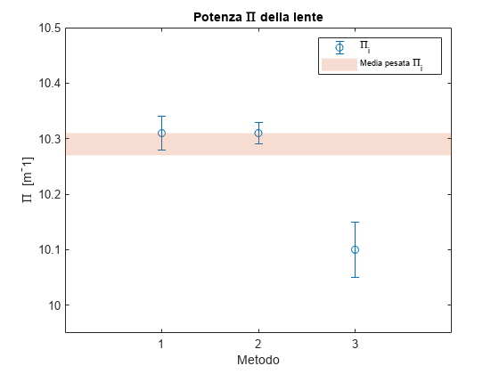

```matlab
% cleaning environment
clc
clear all
```

```matlab
% importing data
df1 = readtable("https://docs.google.com/spreadsheets/d/e/2PACX-1vQgTBH8O8poeZfj9jzisyRf7N_LQ4I4pW6F1-crvknL2diNhYowfQI-BnnuvBbyuJh1FurJZ_X3Q5_5/pub?gid=999031192&single=true&output=csv")
```

| |description|value|uom|uncertainty|tool|
|:--:|:--:|:--:|:--:|:--:|:--:|
|1|'lunghezza fenditura...|1.8500|'cm'|0.0050|'calibro'|

```matlab
df2 = readtable("https://docs.google.com/spreadsheets/d/e/2PACX-1vQgTBH8O8poeZfj9jzisyRf7N_LQ4I4pW6F1-crvknL2diNhYowfQI-BnnuvBbyuJh1FurJZ_X3Q5_5/pub?gid=0&single=true&output=csv")
```

| |configuration|measure_id|x_proiettore|x_oggetto|x_lente|x_schermo_inf|x_schermo_sup|x_uncertainty|x_uom|x_tool|l_img_inf|l_img_sup|l_uncertainty|l_uom|l_tool|
|:--:|:--:|:--:|:--:|:--:|:--:|:--:|:--:|:--:|:--:|:--:|:--:|:--:|:--:|:--:|:--:|
|1|1|'C1M1'|4.6000|10.1000|21.8000|66.3000|78.4000|0.0500|'CMT'|'regolo'|6.3600|7.8500|0.0050|'CMT'|'calibro'|
|2|1|'C1M2'|4.6000|10.1000|22.5000|60.4000|65.9000|0.0500|'CMT'|'regolo'|5.0900|6.2300|0.0050|'CMT'|'calibro'|
|3|1|'C1M3'|4.6000|10.1000|23|59.9000|64.9000|0.0500|'CMT'|'regolo'|5.0650|6.0950|0.0050|'CMT'|'calibro'|
|4|1|'C1M4'|4.6000|10.1000|23.5000|56.8500|58.9000|0.0500|'CMT'|'regolo'|4.2350|4.8500|0.0050|'CMT'|'calibro'|
|5|1|'C1M5'|4.6000|10.1000|24|55.3000|56.8000|0.0500|'CMT'|'regolo'|3.9850|4.3200|0.0050|'CMT'|'calibro'|
|6|1|'C1M6'|4.6000|10.1000|24.5000|53.7000|54.3000|0.0500|'CMT'|'regolo'|3.6000|3.2750|0.0050|'CMT'|'calibro'|
|7|1|'C1M7'|4.6000|10.1000|24.8000|52.8500|54.5000|0.0500|'CMT'|'regolo'|3.2650|3.8900|0.0050|'CMT'|'calibro'|
|8|1|'C1M8'|4.6000|10.1000|25|52.8000|53.8000|0.0500|'CMT'|'regolo'|3.4100|3.5350|0.0050|'CMT'|'calibro'|
|9|1|'C1M9'|4.6000|10.1000|25.3000|51.9000|53|0.0500|'CMT'|'regolo'|3.1500|3.9950|0.0050|'CMT'|'calibro'|
|10|1|'C1M10'|4.6000|10.1000|25.5000|51.6000|52.8000|0.0500|'CMT'|'regolo'|3|3.2850|0.0050|'CMT'|'calibro'|

```matlab
df3 = readtable("https://docs.google.com/spreadsheets/d/e/2PACX-1vQgTBH8O8poeZfj9jzisyRf7N_LQ4I4pW6F1-crvknL2diNhYowfQI-BnnuvBbyuJh1FurJZ_X3Q5_5/pub?gid=371031841&single=true&output=csv")
```

| |configuration|measure_ID|x_oggetto|x_lente|x_schermo|x_uncertainty|x_uom|l_immagine|l_uncertainty|
|:--:|:--:|:--:|:--:|:--:|:--:|:--:|:--:|:--:|:--:|
|1|2|'C2M1'|10|29.8000|49.6000|0.0500|'CMT'|1.8400|0.0050|

```matlab
df4 = readtable("https://docs.google.com/spreadsheets/d/e/2PACX-1vQgTBH8O8poeZfj9jzisyRf7N_LQ4I4pW6F1-crvknL2diNhYowfQI-BnnuvBbyuJh1FurJZ_X3Q5_5/pub?gid=245849005&single=true&output=csv")
```

| |configuration|measure_id|x_oggetto|x_schermo|x_medio|x_lente_1|x_lente_2|x_uncertainty|uom|tool|s|d|delta|
|:--:|:--:|:--:|:--:|:--:|:--:|:--:|:--:|:--:|:--:|:--:|:--:|:--:|:--:|
|1|3|'C3M1'|10.1000|54|32.0500|24.1500|38.9000|0.0500|'CMT'|'regolo'|7.9000|6.8500|1.0500|
|2|3|'C3M2'|10.1000|54.5000|32.3000|24.3500|39.0500|0.0500|'CMT'|'regolo'|7.9500|6.7500|1.2000|
|3|3|'C3M3'|10.1000|55|32.5500|24.6500|39.6500|0.0500|'CMT'|'regolo'|7.9000|7.1000|0.8000|
|4|3|'C3M4'|10.1000|55.5000|32.8000|24.2500|40.2000|0.0500|'CMT'|'regolo'|8.5500|7.4000|1.1500|
|5|3|'C3M5'|10.1000|56|33.0500|23.9000|40.8500|0.0500|'CMT'|'regolo'|9.1500|7.8000|1.3500|
|6|3|'C3M6'|10.1000|56.5000|33.3000|24.0500|40.6500|0.0500|'CMT'|'regolo'|9.2500|7.3500|1.9000|
|7|3|'C3M7'|10.1000|56.7000|33.4000|24.1000|41.7000|0.0500|'CMT'|'regolo'|9.3000|8.3000|1|
|8|3|'C3M8'|10.1000|57|33.5500|24.1500|42.1000|0.0500|'CMT'|'regolo'|9.4000|8.5500|0.8500|
|9|3|'C3M9'|10.1000|57.3000|33.7000|24|42.2500|0.0500|'CMT'|'regolo'|9.7000|8.5500|1.1500|
|10|3|'C3M10'|10.1000|57.5000|33.8000|24.1000|42.8500|0.0500|'CMT'|'regolo'|9.7000|9.0500|0.6500|
|11|3|'C3M11'|10.1000|57.8000|33.9500|23.9500|43.0500|0.0500|'CMT'|'regolo'|10|9.1000|0.9000|

```matlab
% assegno lunghezza oggetto
o = df1.value
```

```text:Output
o = 1.8500
```

```matlab

% calcolo p: distanza oggetto-lente
p = abs(df2.x_lente - df2.x_oggetto);
dp = df2.x_uncertainty.*2;

% calcolo posizione immagine (media)
xi  = abs(df2.x_schermo_sup + df2.x_schermo_inf)./2;     % posizione immagine
dxi = abs(df2.x_schermo_sup - df2.x_schermo_inf)./2;     % incertezza su posizione immagine

% calcolo q: distanza lente-immagine
q   = abs(df2.x_lente - xi);                             % distanza lente-immagine
dq  = sqrt(df2.x_uncertainty.^2 + dxi.^2);               % incertezza sulla distanza lente_immagine

% old code
% q_inf = abs(df2.x_lente - df2.x_schermo_inf);
% q_sup = abs(df2.x_lente - df2.x_schermo_sup);
% q = (q_inf+q_sup)/2;
% dq = abs(df2.x_schermo_sup - df2.x_schermo_inf)/2;

% preview

plot(p,dq)
xlabel("p")
ylabel("dq")
```


noto che l'ampiezza del semi intervallo diminuisce all'aumentare di p distanza oggetto lente

```matlab
% preview
[p dp q dq]
```

```text:Output
ans = 10x4    
   11.7000    0.1000   50.5500    6.0502
   12.4000    0.1000   40.6500    2.7505
   12.9000    0.1000   39.4000    2.5005
   13.4000    0.1000   34.3750    1.0262
   13.9000    0.1000   32.0500    0.7517
   14.4000    0.1000   29.5000    0.3041
   14.7000    0.1000   28.8750    0.8265
   14.9000    0.1000   28.3000    0.5025
   15.2000    0.1000   27.1500    0.5523
   15.4000    0.1000   26.7000    0.6021

```

```matlab

% approssimo valori, uniformo cifre decimali, esporto tabella
T = table(df2.measure_id,latexerror(p,dp), latexerror(q,dq),'VariableNames',{'Measure ID','$p \pm \delta p$','$q \pm \delta q$'})
```

| |Measure ID|$p \\pm \\delta p$|$q \\pm \\delta q$|
|:--:|:--:|:--:|:--:|
|1|'C1M1'|"$11.7 \\pm 0.1$"|"$51 \\pm 6$"|
|2|'C1M2'|"$12.4 \\pm 0.1$"|"$41 \\pm 3$"|
|3|'C1M3'|"$12.9 \\pm 0.1$"|"$39 \\pm 3$"|
|4|'C1M4'|"$13.4 \\pm 0.1$"|"$34 \\pm 1$"|
|5|'C1M5'|"$13.9 \\pm 0.1$"|"$32.0 \\pm 0.8$"|
|6|'C1M6'|"$14.4 \\pm 0.1$"|"$29.5 \\pm 0.3$"|
|7|'C1M7'|"$14.7 \\pm 0.1$"|"$28.9 \\pm 0.8$"|
|8|'C1M8'|"$14.9 \\pm 0.1$"|"$28.3 \\pm 0.5$"|
|9|'C1M9'|"$15.2 \\pm 0.1$"|"$27.2 \\pm 0.6$"|
|10|'C1M10'|"$15.4 \\pm 0.1$"|"$26.7 \\pm 0.6$"|

```matlab
exportLatexTable(T,"../data/pq.tex")
```

```text:Output
Tabella LaTeX esportata correttamente nel file "../data/pq.tex".
```

# Determinazione diretta della distanza focale

```matlab
% calcolo f mediante formula (2) scheda
f = (p.*q)./(p+q);

% propagazione errore su f
df = sqrt( (((q./(p+q)).^2).*dp).^2 + (((p./(p+q)).^2).*dq).^2 );

% approssimo f e df
[f, df] = siground(f,df)
```

```text:Output
f = 10x1    
    9.5000
    9.5000
    9.7000
    9.6400
    9.7000
    9.6800
    9.7000
    9.7600
    9.7400
    9.7700

df = 10x1    
    0.2000
    0.2000
    0.2000
    0.1000
    0.0800
    0.0600
    0.1000
    0.0700
    0.0800
    0.0900

```

```matlab

% esporto tabella con p,q,f
T = table(df2.measure_id,latexerror(p,dp), latexerror(q,dq), latexerror(f,df),'VariableNames',{'Measure ID','$p \pm \delta p$','$q \pm \delta q$','$f_d \pm \delta f_d$'})
```

| |Measure ID|$p \\pm \\delta p$|$q \\pm \\delta q$|$f_d \\pm \\delta f_d$|
|:--:|:--:|:--:|:--:|:--:|
|1|'C1M1'|"$11.7 \\pm 0.1$"|"$51 \\pm 6$"|"$9.5 \\pm 0.2$"|
|2|'C1M2'|"$12.4 \\pm 0.1$"|"$41 \\pm 3$"|"$9.5 \\pm 0.2$"|
|3|'C1M3'|"$12.9 \\pm 0.1$"|"$39 \\pm 3$"|"$9.7 \\pm 0.2$"|
|4|'C1M4'|"$13.4 \\pm 0.1$"|"$34 \\pm 1$"|"$9.6 \\pm 0.1$"|
|5|'C1M5'|"$13.9 \\pm 0.1$"|"$32.0 \\pm 0.8$"|"$9.70 \\pm 0.08$"|
|6|'C1M6'|"$14.4 \\pm 0.1$"|"$29.5 \\pm 0.3$"|"$9.68 \\pm 0.06$"|
|7|'C1M7'|"$14.7 \\pm 0.1$"|"$28.9 \\pm 0.8$"|"$9.7 \\pm 0.1$"|
|8|'C1M8'|"$14.9 \\pm 0.1$"|"$28.3 \\pm 0.5$"|"$9.76 \\pm 0.07$"|
|9|'C1M9'|"$15.2 \\pm 0.1$"|"$27.2 \\pm 0.6$"|"$9.74 \\pm 0.08$"|
|10|'C1M10'|"$15.4 \\pm 0.1$"|"$26.7 \\pm 0.6$"|"$9.77 \\pm 0.09$"|

```matlab
exportLatexTable(T,"../data/pqfdirect.tex")
```

```text:Output
Tabella LaTeX esportata correttamente nel file "../data/pqfdirect.tex".
```

```matlab

% media di f
[fm, dfm] = siground(mean(f), mean(df))
```

```text:Output
fm = 9.7000
dfm = 0.1000
```

```matlab

% media pesata di f
[fmw, dfmw] = weightedaverage(f,df,true)
```

```text:Output
fmw = 9.7000
dfmw = 0.0300
```

```matlab

% rappresento f con le incertezze
fig=figure;
errorbar(p,f,df,df,'o')
hold on
plot(10:16,repelem(fmw,length(10:16)),'Color','#D95319')
area((10:16)',repelem(fmw+dfmw,length((10:16)))',fmw-dfmw,"FaceAlpha",0.2,"EdgeColor","none","LineStyle","none","ShowBaseLine","off")
hold off
ylim([9 10])
xlim([11 16])
xlabel("p [cm]")
ylabel("f [cm]")
legend("Misure di f","Media pesata","Intervallo media pesata",'Location','southeast')
saveas(fig,"../img/pf.png")
```


# Significatività della correlazione lineare: indice di Bravais-Pearson

linearizzo l'equazione 

verificare la propagazione degli errori del reciproco. Mi sembra strano si riduca così.

```matlab
% linearizzo equazione
y  = 1./q;
dy = dq./q.^2;
x  = 1./p;
dx = dp./p.^2;

% approssimazione
% [x, dx] = siground(x,dx);
% [y, dy] = siground(y,dy);

% esporto tabella
T=table(latexerror(x,dx), latexerror(y,dy),'VariableNames',{'$x \pm \delta x$','$y \delta y$'})
```

| |$x \\pm \\delta x$|$y \\delta y$|
|:--:|:--:|:--:|
|1|"$0.0855 \\pm 0.0007...|"$0.020 \\pm 0.002$"|
|2|"$0.0806 \\pm 0.0007...|"$0.025 \\pm 0.002$"|
|3|"$0.0775 \\pm 0.0006...|"$0.025 \\pm 0.002$"|
|4|"$0.0746 \\pm 0.0006...|"$0.0291 \\pm 0.0009...|
|5|"$0.0719 \\pm 0.0005...|"$0.0312 \\pm 0.0007...|
|6|"$0.0694 \\pm 0.0005...|"$0.0339 \\pm 0.0003...|
|7|"$0.0680 \\pm 0.0005...|"$0.0346 \\pm 0.001$...|
|8|"$0.0671 \\pm 0.0005...|"$0.0353 \\pm 0.0006...|
|9|"$0.0658 \\pm 0.0004...|"$0.0368 \\pm 0.0007...|
|10|"$0.0649 \\pm 0.0004...|"$0.0375 \\pm 0.0008...|

```matlab
exportLatexTable(T,"../data/linearized_data.tex")
```

```text:Output
Tabella LaTeX esportata correttamente nel file "../data/linearized_data.tex".
```

```matlab

% plot
fig=figure;
errorbar(x,y,dy,dy,dx,dx,'o')
xlabel("x = 1/p [cm]")
ylabel("y = 1/q [cm]")
grid on
saveas(fig,"../img/scatter_linearized.png")
```


```matlab
% coefficiente di bravais pearson

% funzione personale
r1 = abs(bravpear(x,y))
```

```text:Output
r1 = 0.9966
```

```matlab

% funzione matlab
[r2, pval] = corr(x,y)
```

```text:Output
r2 = -0.9966
pval = 6.0816e-10
```

```matlab
pval < 0.01
```

```text:Output
ans = 
   1

```

in questo modo ho comunque verificato che la funzione corr() torna esattamente il valore voluto ovvero quello della funzione bravpear() che corrisponde alla formula per calcolare bravais pearson.

A seguito del calcolo del coefficiente di Bravais-Pearson e del p-value (probabilità che un'insieme di dati presenti una forma di quel tipo senza rapporti di causa effetto) si conclude che le grandezze x e y prsentano una correlazione lineare altamente significativa in quanto pval = 6e-10 << 0.01 = 1%

# Best-fit: metodo dei minimi quadrati

```matlab
% best-fit non pesato
[a1, sigma_a1, b1, sigma_b1] = best_fit_mmq(x,y,true)
```

```text:Output
a1 = 0.0930
sigma_a1 = 0.0020
b1 = -0.8600
sigma_b1 = 0.0300
```

```matlab
yfit1 = a1+b1.*x;

% best-fit pesato
[a2, sigma_a2, b2, sigma_b2] = weighted_best_fit_mmq(x,y,dy,true);
yfit2 = a2+b2.*x;

%best-fit pesato vincolato
b3 = -1   % coefficiente angolare teorico
```

```text:Output
b3 = -1
```

```matlab
[a3, sigma_a3] = weighted_constrained_b_best_fit_mmq(x,y,dy,b3,true)
```

```text:Output
a3 = 0.1031
sigma_a3 = 1.8527e-04
```

```matlab
yfit3 = a3 + b3.*x;

% round text
[ta2, tsigma_a2] = signum2str(a2,sigma_a2)
```

```text:Output
ta2 = '0.094'
tsigma_a2 = '0.005'
```

```matlab
[tb2, tsigma_b2] = signum2str(b2,sigma_b2) 
```

```text:Output
tb2 = '-0.87'
tsigma_b2 = '0.07'
```

```matlab

% plotto insieme
fig = figure;
plot(x,yfit1)
hold on
plot(x,yfit2)
plot(x,yfit3)
errorbar(x,y,dy,dy,dx,dx,'.','Color','#0072BD')
hold off
legend("fit non pesato", "fit pesato","fit pesato vincolato", "valori osservati")
xlabel("x = 1/p [cm^{-1}]")
ylabel("y = 1/q [cm^{-1}]")
title("best-fit lineare")
set(gca,'FontName','Times New Roman')
saveas(fig,"../img/fit.png")
```


```matlab
% test best-fit integrato in matlab
% figure
% plot(x,y,'.');
% ft = fittype('poly1');
% w = 1./dy.^2;
% latexerror = fit(x,y,ft,'Weight',w);
% hold on
% plot(latexerror,'fit',0.95);
```

```matlab
% chi-quadro per un fit (sia pesato che non pesato)
chi1 = fitchisquarered(y,dy,yfit1,2)
```

```text:Output
chi1 = 0.5505
```

```matlab
chi2 = fitchisquarered(y,dy,yfit2,2)
```

```text:Output
chi2 = 0.2351
```

```matlab
chi3 = fitchisquarered(y,dy,yfit3,2)
```

```text:Output
chi3 = 0.7355
```

```matlab
% tabella fit, parametri, chi
a = [a1; a2; a3];
sigma_a = [sigma_a1; sigma_a2; sigma_a3];
b = [b1; b2; b3];
sigma_b = [sigma_b1; sigma_b2; 0.1];
chi = [chi1; chi2; chi3];

T = table((1:3)',latexerror(a,sigma_a),latexerror(b,sigma_b),round(chi,2),'VariableNames',{'Fit','$A \pm \sigma_A$','$B \pm \sigma_B$','$\chi_{red}^2$'})
```

| |Fit|$A \\pm \\sigma_A$|$B \\pm \\sigma_B$|$\\chi_{red}^2$|
|:--:|:--:|:--:|:--:|:--:|
|1|1|"$0.093 \\pm 0.002$"|"$-0.86 \\pm 0.03$"|0.5500|
|2|2|"$0.094 \\pm 0.005$"|"$-0.87 \\pm 0.07$"|0.2400|
|3|3|"$0.1031 \\pm 0.0002...|"$-1.0 \\pm 0.1$"|0.7400|

```matlab
exportLatexTable(T,"../data/ABfit.tex")
```

```text:Output
Tabella LaTeX esportata correttamente nel file "../data/ABfit.tex".
```

```matlab
% stimare f (fmmq) e incertezza 
[fmmq, dfmmq] = siground(1./a,sigma_a./(a.^2))
```

```text:Output
fmmq = 3x1    
   10.8000
   10.6000
    9.7000

dfmmq = 3x1    
    0.2000
    0.6000
    0.0200

```

```matlab

fmmq3 = fmmq(3);
dfmmq3 = dfmmq(3);
```

# Metodo di Bessel

```matlab
% si assume incertezza di 1 cm
ub = df3.x_uncertainty.*2
```

```text:Output
ub = 0.1000
```

```matlab

% distanza oggetto lente
ol = abs(df3.x_oggetto - df3.x_lente)
```

```text:Output
ol = 19.8000
```

```matlab

% distanza lente schermo
ls = abs(df3.x_schermo - df3.x_lente)
```

```text:Output
ls = 19.8000
```

```matlab

% distanza oggetto schermo
D_os = abs(df3.x_oggetto - df3.x_schermo)
```

```text:Output
D_os = 39.6000
```

```matlab
udos = ub.*2;

% stimo f da Bessel
fb = D_os/4
```

```text:Output
fb = 9.9000
```

```matlab

% calcolo errore
dfb = (udos)/4
```

```text:Output
dfb = 0.0500
```

```matlab

% approssimo
[fb, dfb] = siground(fb,dfb)
```

```text:Output
fb = 9.9000
dfb = 0.0500
```

# Potenza lente

```matlab
fs = [fmw; fmmq3; fb];
dfs = [dfmw; dfmmq3; dfb];

pi = 100./fs;
dpi = 100.*dfs./(fs.^2);
[pi, dpi] = siground(pi,dpi)
```

```text:Output
pi = 3x1    
   10.3100
   10.3100
   10.1000

dpi = 3x1    
    0.0300
    0.0200
    0.0500

```

```matlab
% media pesata
[mpi, dmpi] = weightedaverage(pi,dpi,true)
```

```text:Output
mpi = 10.2900
dmpi = 0.0200
```

```matlab

formula = ["\ref{eq:}";"\ref{eq:}";"\ref{eq:}"];

T=table((1:3)',formula,latexerror(pi,dpi),texreler(pi,dpi),'VariableNames',{'Metodo','Equazione','$\Pi \pm \delta \Pi$','$\frac{\delta \Pi}{\Pi}$'})
```

| |Metodo|Equazione|$\\Pi \\pm \\delta \\Pi$|$\\frac{\\delta \\Pi}{\\Pi}$|
|:--:|:--:|:--:|:--:|:--:|
|1|1|"\\ref{eq:}"|"$10.31 \\pm 0.03$"|"0.29\\%"|
|2|2|"\\ref{eq:}"|"$10.31 \\pm 0.02$"|"0.19\\%"|
|3|3|"\\ref{eq:}"|"$10.10 \\pm 0.05$"|"0.5\\%"|

```matlab
exportLatexTable(T,"../data/potenza-lente.tex")
```

```text:Output
Tabella LaTeX esportata correttamente nel file "../data/potenza-lente.tex".
```

```matlab

fig = figure;
errorbar((1:3),pi,dpi,dpi,'o')
hold on
area((0:4)',repelem(mpi+dmpi,length((0:4)))',mpi-dmpi,"FaceAlpha",0.2,"EdgeColor","none","LineStyle","none","ShowBaseLine","off")
hold off
ylim([9.95 10.5])
xlim([0 4])
xticks(1:3)
xlabel("Metodo")
ylabel("\Pi  [m^-1]",'Interpreter','tex')
title("Potenza \Pi della lente")
legend("\Pi_i","Media pesata \Pi_i")
saveas(fig,"../img/potenza-lente.png")
```



# Ingrandimento 

```matlab
l_oggetto = df1.value;
dlo = df1.uncertainty;

l_immagine = (df2.l_img_sup + df2.l_img_inf)./2;
```

assumo come incertezza sulla lunghezza dell'immagine il semi intervallo

```matlab
dli = abs(df2.l_img_sup - df2.l_img_inf)./2;

% calcolo m come rapporto i/o
m1 = l_immagine./l_oggetto;
dm1 = sqrt( (dli./l_oggetto).^2 + ((l_immagine.*dlo)./(l_oggetto.^2)).^2 );

% approssimo significativamente
[m1, dm1] = siground(m1,dm1);
[tm1, tdm1] = signum2str(m1,dm1);
[tli, tdli] = signum2str(l_immagine,dli);
tlinf = signum2str(df2.l_img_inf,df2.l_uncertainty);
tlsup = signum2str(df2.l_img_sup,df2.l_uncertainty);

% esporto tabella
header = {'Measure ID', '$l_{inf} \; [cm]$','$l_{sup} \; [cm]$','i [cm]','$\delta i \; [cm]$','$m_1$','$\delta m_1$'};
T=table(df2.measure_id,tlinf, tlsup, tli, tdli, tm1, tdm1,'VariableNames',header)
```

| |Measure ID|$l_{inf\|$l_{sup\|i [cm]|$\\delta i \\; [cm]$|$m_1$|$\\delta m_1$|
|:--:|:--:|:--:|:--:|:--:|:--:|:--:|:--:|
|1|'C1M1'|"6.360"|"7.850"|"7.1"|"0.7"|"3.8"|"0.4"|
|2|'C1M2'|"5.090"|"6.230"|"5.7"|"0.6"|"3.1"|"0.3"|
|3|'C1M3'|"5.065"|"6.095"|"5.6"|"0.5"|"3.0"|"0.3"|
|4|'C1M4'|"4.235"|"4.850"|"4.5"|"0.3"|"2.5"|"0.2"|
|5|'C1M5'|"3.985"|"4.320"|"4.2"|"0.2"|"2.24"|"0.09"|
|6|'C1M6'|"3.600"|"3.275"|"3.4"|"0.2"|"1.86"|"0.09"|
|7|'C1M7'|"3.265"|"3.890"|"3.6"|"0.3"|"1.9"|"0.2"|
|8|'C1M8'|"3.410"|"3.535"|"3.47"|"0.06"|"1.88"|"0.03"|
|9|'C1M9'|"3.150"|"3.995"|"3.6"|"0.4"|"1.9"|"0.2"|
|10|'C1M10'|"3.000"|"3.285"|"3.1"|"0.1"|"1.70"|"0.08"|

```matlab
writetable(T,"../data/mio.csv")
```

```matlab
% calcolo m come rapporto q/p e propago incertezza
m2 = q./p;
dm2 = sqrt( (dq./p).^2 + ((q.*dp)./(p.^2)).^2 );

% approssimo sulla base del numero di cifre significative
[m2, dm2] = siground(m2,dm2);

% preview
% table(df2.measure_id,tq,tp,tm2, tdm2,'VariableNames',{'Measure ID','q','p','$m_2$','$\delta m_2$'})
```

```matlab
% confronto i valori di m ottenuti tramite i due metodi

% calcolo distanze
[t_diff_m, t_error_diffm] = signum2str(abs(m2-m1),dm1+dm2);

% creo tabella da esportare
headers = {'Measure ID', '$m_1 \pm \delta m_1$','$m_2 \pm \delta m_2$','$\Delta m$'};
T = table(df2.measure_id,latexerror(m1,dm1), latexerror(m2,dm2), t_diff_m,'VariableNames',headers)
```

| |Measure ID|$m_1 \\pm \\delta m_1$|$m_2 \\pm \\delta m_2$|$\\Delta m$|
|:--:|:--:|:--:|:--:|:--:|
|1|'C1M1'|"$3.8 \\pm 0.4$"|"$4.3 \\pm 0.5$"|"0.5"|
|2|'C1M2'|"$3.1 \\pm 0.3$"|"$3.3 \\pm 0.2$"|"0.2"|
|3|'C1M3'|"$3.0 \\pm 0.3$"|"$3.1 \\pm 0.2$"|"0.1"|
|4|'C1M4'|"$2.5 \\pm 0.2$"|"$2.57 \\pm 0.08$"|"0.1"|
|5|'C1M5'|"$2.24 \\pm 0.09$"|"$2.31 \\pm 0.06$"|"0.1"|
|6|'C1M6'|"$1.86 \\pm 0.09$"|"$2.05 \\pm 0.03$"|"0.2"|
|7|'C1M7'|"$1.9 \\pm 0.2$"|"$1.96 \\pm 0.06$"|"0.1"|
|8|'C1M8'|"$1.88 \\pm 0.03$"|"$1.90 \\pm 0.04$"|"0.02"|
|9|'C1M9'|"$1.9 \\pm 0.2$"|"$1.79 \\pm 0.04$"|"0.1"|
|10|'C1M10'|"$1.70 \\pm 0.08$"|"$1.73 \\pm 0.04$"|"0.0"|

```matlab
writetable(T,"../data/ms.csv")
```

```matlab
% costruisco dataset per plot
ms = [m1, m2];
dms = [dm1, dm2];

fig=figure;
for i=1:10
    subplot(2,5,i)
    errorbar(1:2,ms(i,:)',dms(i,:)',dms(i,:)','o')
    title(sprintf("C1M%i",i))
    xlim([0 3])
    xticks(1:2)
end

saveas(fig,"../img/ms_r.png")
```


  
# Valutazione errori sistematici

```matlab
df4
```

| |configuration|measure_id|x_oggetto|x_schermo|x_medio|x_lente_1|x_lente_2|x_uncertainty|uom|tool|s|d|delta|
|:--:|:--:|:--:|:--:|:--:|:--:|:--:|:--:|:--:|:--:|:--:|:--:|:--:|:--:|
|1|3|'C3M1'|10.1000|54|32.0500|24.1500|38.9000|0.0500|'CMT'|'regolo'|7.9000|6.8500|1.0500|
|2|3|'C3M2'|10.1000|54.5000|32.3000|24.3500|39.0500|0.0500|'CMT'|'regolo'|7.9500|6.7500|1.2000|
|3|3|'C3M3'|10.1000|55|32.5500|24.6500|39.6500|0.0500|'CMT'|'regolo'|7.9000|7.1000|0.8000|
|4|3|'C3M4'|10.1000|55.5000|32.8000|24.2500|40.2000|0.0500|'CMT'|'regolo'|8.5500|7.4000|1.1500|
|5|3|'C3M5'|10.1000|56|33.0500|23.9000|40.8500|0.0500|'CMT'|'regolo'|9.1500|7.8000|1.3500|
|6|3|'C3M6'|10.1000|56.5000|33.3000|24.0500|40.6500|0.0500|'CMT'|'regolo'|9.2500|7.3500|1.9000|
|7|3|'C3M7'|10.1000|56.7000|33.4000|24.1000|41.7000|0.0500|'CMT'|'regolo'|9.3000|8.3000|1|
|8|3|'C3M8'|10.1000|57|33.5500|24.1500|42.1000|0.0500|'CMT'|'regolo'|9.4000|8.5500|0.8500|
|9|3|'C3M9'|10.1000|57.3000|33.7000|24|42.2500|0.0500|'CMT'|'regolo'|9.7000|8.5500|1.1500|
|10|3|'C3M10'|10.1000|57.5000|33.8000|24.1000|42.8500|0.0500|'CMT'|'regolo'|9.7000|9.0500|0.6500|
|11|3|'C3M11'|10.1000|57.8000|33.9500|23.9500|43.0500|0.0500|'CMT'|'regolo'|10|9.1000|0.9000|

```matlab

% calcolo punto medio distanza oggetto schermo
pmos = (df4.x_oggetto + df4.x_schermo)/2;
dpmos = df4.x_uncertainty./sqrt(2);

% calcolo s e d 
% s: distanza pmos e prima posizione lente
% d: distanza pmos e seconda posizione lente
s = abs(df4.x_lente_1 - pmos);
d = abs(df4.x_lente_2 - pmos);

% propagazione errori
ds = 1.5.*df4.x_uncertainty;

% differenze
eta = s-d;
deta = ds.*sqrt(2);

fig=figure;
histfit(eta,5)
title("Distribuzione di \eta")
xlabel("[cm]")
saveas(fig,"../img/eta.png")
```


```matlab

[eta_best, sigma_eta] = siground(mean(eta),std(eta))
```

```text:Output
eta_best = 1.1000
sigma_eta = 0.3000
```

```matlab

% converto in testo ed esporto tabella
[tpmos,tds] = signum2str(pmos,ds);
ts = signum2str(s,ds);
td = signum2str(d,ds);
teta = signum2str(eta,deta);

T=table(df4.measure_id,tpmos,ts,td,teta,'VariableNames',{'Measure ID','$x_m$','s','d','$\eta$'})
```

| |Measure ID|$x_m$|s|d|$\\eta$|
|:--:|:--:|:--:|:--:|:--:|:--:|
|1|'C3M1'|"32.05"|"7.90"|"6.85"|"1.0"|
|2|'C3M2'|"32.30"|"7.95"|"6.75"|"1.2"|
|3|'C3M3'|"32.55"|"7.90"|"7.10"|"0.8"|
|4|'C3M4'|"32.80"|"8.55"|"7.40"|"1.1"|
|5|'C3M5'|"33.05"|"9.15"|"7.80"|"1.3"|
|6|'C3M6'|"33.30"|"9.25"|"7.35"|"1.9"|
|7|'C3M7'|"33.40"|"9.30"|"8.30"|"1.0"|
|8|'C3M8'|"33.55"|"9.40"|"8.55"|"0.8"|
|9|'C3M9'|"33.70"|"9.70"|"8.55"|"1.1"|
|10|'C3M10'|"33.80"|"9.70"|"9.05"|"0.6"|
|11|'C3M11'|"33.95"|"10.00"|"9.10"|"0.9"|

```matlab
exportLatexTable(T,"../data/sd.tex")
```

```text:Output
Tabella LaTeX esportata correttamente nel file "../data/sd.tex".
```

```matlab
writetable(T,"../data/sd.csv")
```

# Conclusioni e confronti

```matlab
% distanza focale
% costruisco dataset delle f ottenute con diversi metodi
fs = [fmw; fmmq3; fb];
dfs = [dfmw; dfmmq3; dfb];
method=(1:3)';
description = {'media pesata'; 'best-fit pesato e vincolato'; 'bessel'};

T=table(method, description, latexerror(fs,dfs), 'VariableNames',{'Metodo','Descrizione','$f \pm \delta f$'})
```

| |Metodo|Descrizione|$f \\pm \\delta f$|
|:--:|:--:|:--:|:--:|
|1|1|'media pesata'|"$9.70 \\pm 0.03$"|
|2|2|'best-fit pesato e v...|"$9.70 \\pm 0.02$"|
|3|3|'bessel'|"$9.90 \\pm 0.05$"|

```matlab
exportLatexTable(T,"../data/fs.tex")
```

```text:Output
Tabella LaTeX esportata correttamente nel file "../data/fs.tex".
```

```matlab

% media pesata
[fwa, dfwa] = weightedaverage(fs,dfs,true)
```

```text:Output
fwa = 9.7200
dfwa = 0.0200
```

```matlab

% forse meglio rapprsentarli con colori diversi. Fare un fr con scatterplot
fig=figure;
errorbar(1:length(fs),fs,dfs,dfs,'o') 
hold on
area([0:4]',repelem(fwa+dfwa,length([0:4]))',fwa-dfwa,"FaceAlpha",0.2,"EdgeColor","none","LineStyle","none","ShowBaseLine","off")
hold off
ylim([9.4 10.1])
xlim([0.5 3.5])
xticks(1:3)
xlabel("Metodo")
ylabel("f [cm]")
title("Stima della distanza focale f")
legend("f_i","Media pesata di f_i",Location="southeast")
saveas(fig,"../img/fs.png")
```


```matlab

% aggiungo errore sistematico
%dfs = sqrt(dfs.^2+eta_best.^2);

dfs = dfs+eta_best;
[fs, dfs] = siground(fs,dfs)
```

```text:Output
fs = 3x1    
    10
    10
    10

dfs = 3x1    
     1
     1
     1

```

```matlab
% media pesata
[fwa, dfwa] = weightedaverage(fs,dfs,true)
```

```text:Output
fwa = 10
dfwa = 0.6000
```

```matlab

fig=figure;
errorbar(1:length(fs),fs,dfs,dfs,'o') 
hold on
area([0:4]',repelem(fwa+dfwa,length([0:4]))',fwa-dfwa,"FaceAlpha",0.2,"EdgeColor","none","LineStyle","none","ShowBaseLine","off")
hold off
ylim([5 12])
xlim([0.5 3.5])
xticks(1:3)
xlabel("Metodo")
ylabel("f [cm]")
title("Stima della distanza focale f")
legend("f_i","Media pesata di f_i",Location="southeast")
saveas(fig,"../img/fs-sist.png")
```


```matlab

T=table(method, description, latexerror(fs,dfs), 'VariableNames',{'Metodo','Descrizione','$f \pm \Delta f$'})
```

| |Metodo|Descrizione|$f \\pm \\Delta f$|
|:--:|:--:|:--:|:--:|
|1|1|'media pesata'|"$10 \\pm 1$"|
|2|2|'best-fit pesato e v...|"$10 \\pm 1$"|
|3|3|'bessel'|"$10 \\pm 1$"|

```matlab
exportLatexTable(T,"../data/fs-sist.tex")
```

```text:Output
Tabella LaTeX esportata correttamente nel file "../data/fs-sist.tex".
```

```matlab

% potenza
```

```matlab
% exporting mlx2m
mlxloc = fullfile(pwd,'analysis.mlx');
fileout = 'analysis.m';
matlab.internal.liveeditor.openAndConvert(mlxloc,fileout);
```

# Functions

```matlab
function r = bravpear(x,y)
    % coefficiente di Bravais-Pearson
    r = sum((x - repelem(mean(x),length(x),1))  .*  (y - repelem(mean(y),length(y),1))) ./ (  sqrt(sum((x - repelem(mean(x),length(x),1)).^2) .* sum((y - repelem(mean(y),length(y),1)).^2))  );
end

% uncertainty significative rounding
function dx = usiground(dx)
    % numero decimali
    n = abs(floor(log10(dx)));
    
    % lunghezza vettore dx
    l = length(dx);
    
    if l==1
        dx = round(dx,n);
    else
        scale_factor = power(10, n);
        dx = round(dx .* scale_factor) ./ scale_factor;
    end
end

% significative rounding
% siground(x,dx)
% x:  misura
% dx: incertezza
% Description: approssima al corretto numero di cifre decimali la misura x e
% l'incertezza dx. L'output sarà un numero e non un testo.
% usage: [x, dx] = siground(x,dx)
function [x, dx] = siground(x,dx)
    % calcola numero di decimali
    n = abs(floor(log10(dx)));
    
    % calcola dimensione vettore
    l = length(n);

    if l==1
        % approssima incertezza
        dx = round(dx,n);

        % approssima misura
        x = round(x,n);
    else
        %disp("Vettori non ancora supportati del tutto. Da testare")
        scale_factor = power(10, n);
        dx = round(dx .* scale_factor) ./ scale_factor;
        x  = round(x .* scale_factor) ./ scale_factor;
    end
end

% determina i coefficienti della best-fit line utilizzando il metodo dei
% minimi quadrati
function [a, sigma_a, b, sigma_b] = best_fit_mmq(x,y,f)
    % f: flag rounding, true or false

    % best fit lineare nella forma
    % y = A + Bx

    % numero di punti
    n = length(x);
    
    delta = n.*sum(x.^2) - (sum(x)).^2;
    
    % intercetta
    a = (   (sum(x.^2).*sum(y))  - (sum(x).*sum(x.*y))   )./delta;

    % coefficiente angolare
    b = (   (n.*sum(x.*y)) - (sum(x).*sum(y))   )./delta;

    % sigma y eq 8.15 Taylor
    sigma_y = sqrt(sum((y - repelem(a,n,1) - repelem(b,n,1).*x).^2)./(n - 2)); %sigma_y = round(sigma_y,2)

    % errore su a eq. 8.16 Taylor
    sigma_a = sigma_y .* sqrt((sum(x.^2))./(delta));

    % errore su b eq. 8.17 Taylor
    sigma_b = sigma_y .* sqrt(n./delta);
    
    % arrotondo sulla scelta utente
    if f == true
        sigma_a = usiground(sigma_a);
        sigma_b = usiground(sigma_b);
        a = siground(a,sigma_a);
        b = siground(b,sigma_b);
    end
end

% determina i coefficienti della best-fit line utilizzando il metodo dei
% minimi quadrati pesata. Formule della pagina 201 del Taylor
function [a, sigma_a, b, sigma_b] = weighted_best_fit_mmq(x,y,dy,f)
    % f: flag rounding, true or false

    % best fit lineare nella forma
    % y = A + Bx
    
    % pesi
    w = 1./dy.^2;
    
    % denominatore eq. 8.39 Taylor
    delta = (sum(w).*sum(w.*x.^2)) - (sum(w.*x)).^2;
    
    % intercetta eq. 8.37 Taylor
    a = (   (sum(w.*x.^2).*sum(w.*y))  - (sum(w.*x).*sum(w.*x.*y))   )./delta;

    % coefficiente angolare eq. 8.38 Taylor
    b = (   (sum(w).*sum(w.*x.*y)) - (sum(w.*x).*sum(w.*y))   )./delta;

    % errore su a
    sigma_a = sqrt((sum(w.*x.^2))./delta);

    % errore su b
    sigma_b = sqrt(sum(w)./delta);
    
    % arrotondo sulla scelta utente
    if f == true
        sigma_a = usiground(sigma_a);
        sigma_b = usiground(sigma_b);
        a = siground(a,sigma_a);
        b = siground(b,sigma_b);
    end
end

function [a, sigma_a] = weighted_constrained_b_best_fit_mmq(x,y,dy,b,flag)
    % numero punti
    n = length(x);

    % assegno pesi
    w = 1./(dy.^2);
    
    % calcolo denominatore
    d = sum(w);
    
    % calcolo intercetta e incertezza
    a =  (sum(w.*y) - (sum(w.*x).*b))./d;
    sigma_a = sqrt((sum(w.*((y - b.*x - a).^2))./(n-1))./d);
end

% approssima misura e incertezza allo stesso numero di cifre significative
% e converti in testo
% input
% x:  misura
% dx: incertezza misura
function [tx, tdx] = single_signum2str(x,dx)
    
    % calcolo numero di cifre a cui approssimare
    n = abs(floor(log10(dx)));

    % tdx = num2str(round(dx,n));
    tdx = num2str(usiground(dx));

    % costruisco formato dinamico (e.g. %.4f)
    formato = ['%.', num2str(n), 'f'];

    % creo stringa
    tx = sprintf(formato, x);
end

function [tx, tdx] = signum2str(x,dx)
    % fa la stessa cosa di signum2str(x,dx) ma opera su x e dx vettoriali
    % della stessa lunghezza

    % calcola lunghezza x e dx
    if length(x) == length(dx)
        l = length(x);
        
        % se il vettore è di lunghezza 1, ovvero è uno scalare, usa la
        % funzione single_signum2str(). 
        % Questo generalizza signum2str() che
        % si può usare sia nel caso scalare che vettoriale

        if l==1
            [tx, tdx] = single_signum2str(x,dx);
        else
            % inizializza array di stringhe
            tx = strings(l,1);
            tdx = tx;
    
            for i=1:l
                [tx(i), tdx(i)] = signum2str(x(i),dx(i));
            end
        end
    else
        disp("Error: length mismatch")
    end
end

% chi quadro di un fit
function chi = fitchisquarered(y,dy,yfit,params)
    chi = sum(((yfit-y)./dy).^2)./(length(y)-params);
end

% formatta valore \pm misura come latex
% misura e errore devono essere stringhe
function text = latexerror(misura,errore)
    if isnumeric(misura) && isnumeric(errore)
        [tmisura, terrore] = signum2str(misura,errore);
        text = "$" + tmisura + " \pm " + terrore + "$";
    else
        if ischar(misura) && ischar(errore)
            text = "$" + misura + " \pm " + errore + "$";
        end
    end
end

function exportLatexTable(tableData, fileName)
    % Apri il file in modalità scrittura
    fileID = fopen(fileName, 'w');
    
    % Ottieni il numero di colonne della tabella
    numCols = size(tableData, 2);
    
    % Ottieni le intestazioni della tabella
    headers = string(tableData.Properties.VariableNames);

    % Scrivi l'intestazione della tabella LaTeX
    fprintf(fileID, '\\begin{longtable}{@{}');
    for i = 1:numCols
        fprintf(fileID, 'l');
    end
    fprintf(fileID, '@{}}\n');
    
    % Scrivi l'intestazione delle colonne
    fprintf(fileID, '\\toprule\n');
    for i = 1:numCols
        fprintf(fileID, '%s', headers(i));
        if i < numCols
            fprintf(fileID, ' & ');
        else
            fprintf(fileID, ' \\tabularnewline\n');
        end
    end
    
    % Scrivi la riga divisoria
    fprintf(fileID, '\\midrule\n');
    
    % Scrivi i dati della tabella
    for row = 1:size(tableData, 1)
        for col = 1:numCols
            % Sostituisci "data" con i valori effettivi della tabella
            fprintf(fileID, '%s', string(table2cell(tableData(row, col))));
            if col < numCols
                fprintf(fileID, ' & ');
            else
                fprintf(fileID, ' \\tabularnewline\n');
            end
        end
    end
    
    % Scrivi la riga finale della tabella LaTeX
    fprintf(fileID, '\\bottomrule\n');
    
    % Scrivi etichetta e caption della tabella
    fprintf(fileID, '\\label{tab:edithere}\n');
    fprintf(fileID, '\\\\');
    fprintf(fileID, '\n\\caption{edithere}\n');
    fprintf(fileID, '\\end{longtable}\n');

    % Chiudi il file
    fclose(fileID);
    
    fprintf('Tabella LaTeX esportata correttamente nel file "%s".\n', fileName);
end

function e = texreler(measure,uncertainty)
    e = round(100.*(uncertainty./measure),2);
    e = string(e) + "\%";
end

function [e, de] = weightedaverage(measure, uncertainty,flag)
    % input
    % measure: vettore contenente le misure da mediare
    % incertezza: vettore contenente le incertezze sulle misure
    % flag: se true, allora approssima il risultato sulla base del numero
    % di cifre significative dell'errore della media pesata.

    % output
    % e: media pesata
    % de: errore sulla media
    
    % assegno pesi
    w = 1./(uncertainty.^2);
    
    % calcolo media ed errore
    e   = sum(w.*measure) ./ sum(w);
    de  = sqrt(1./sum(w));

    % approssima
    if flag==true
        [e, de] = siground(e,de);
    end
end

```
